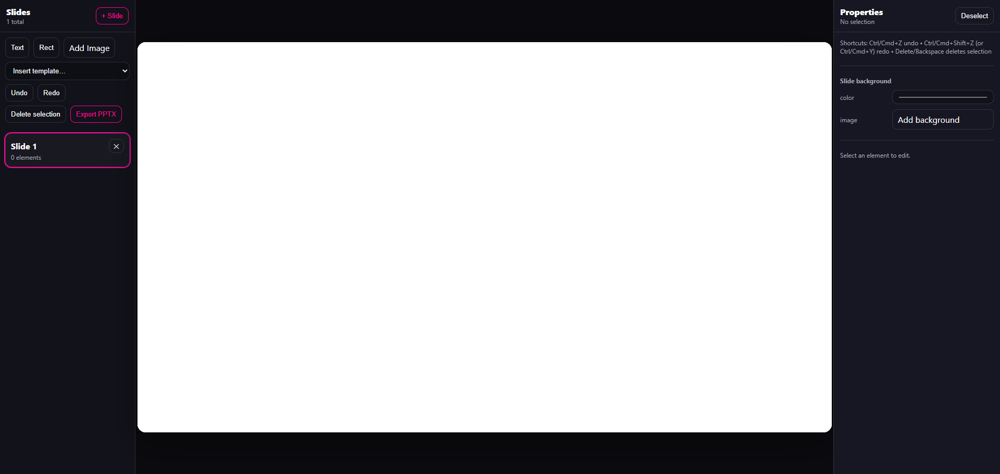
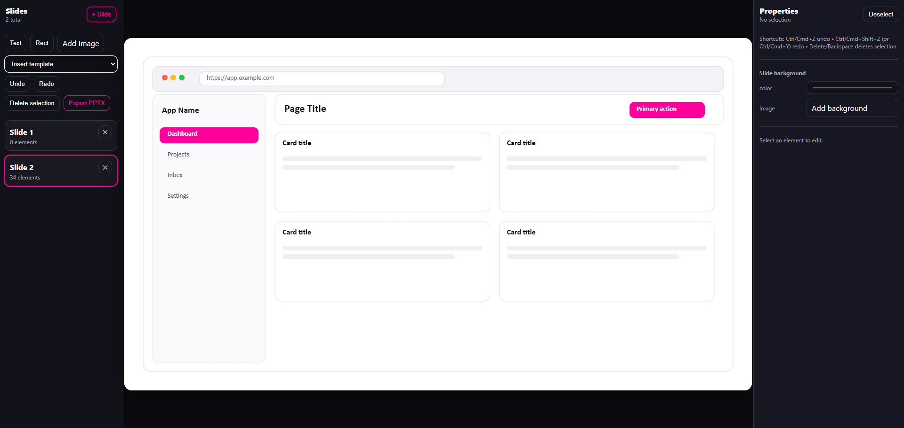

# Presentation Slide Editor

A lightweight, local-first visual slide editor that exports real PowerPoint (.pptx) files — directly in your browser.

---

## Preview

### Empty Canvas


### Template Example


---

## What this is

This is a **design → export engine**:
- Build slides visually
- Structure elements with precision
- Export directly to PowerPoint

---

## Features

- Multi-slide support
- Drag / resize / rotate elements
- Undo / redo
- Image upload + backgrounds
- Templates (dashboard, mobile, kanban, etc.)
- PPTX export

---

## Unique Capability

### Step-based animation system

Supports progressive reveal via `appearStep` during export.

---

## Quick Start

```bash
git clone https://github.com/monapdx/presentation-slide-editor.git
cd presentation-slide-editor
npm install
npm run dev
```

---

## Contributing

See CONTRIBUTING.md and Issues tab.
